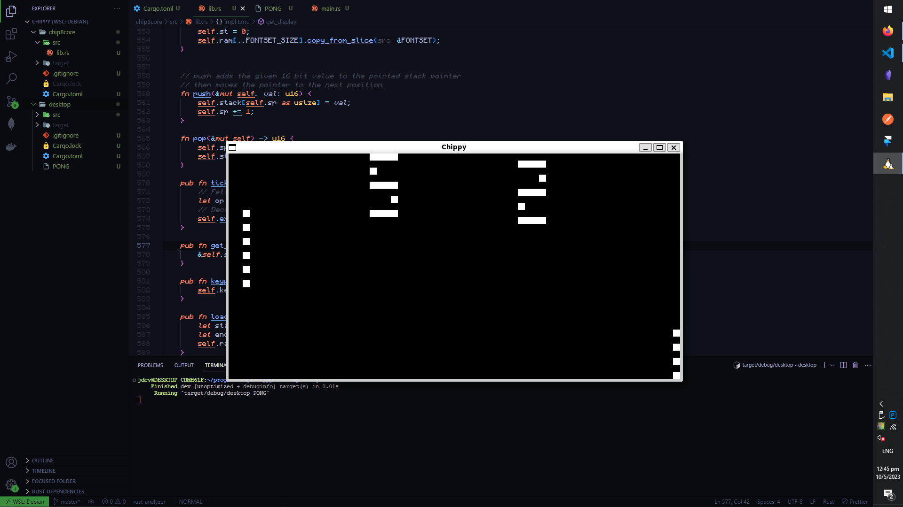

# Chippy



## Description

Chippy is a Chip-8 interpreter written in Rust. It was mainly built to understand how low level computer systems operate. 
It also helped in understand the Rust programming language. 


## Installation

```sh
cargo run PONG

```
